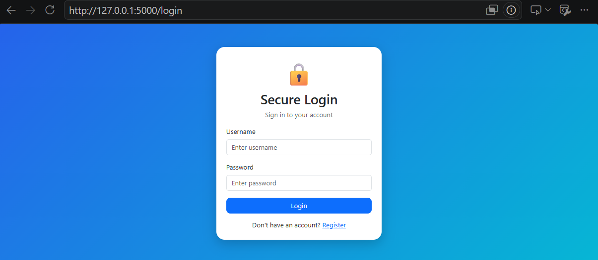
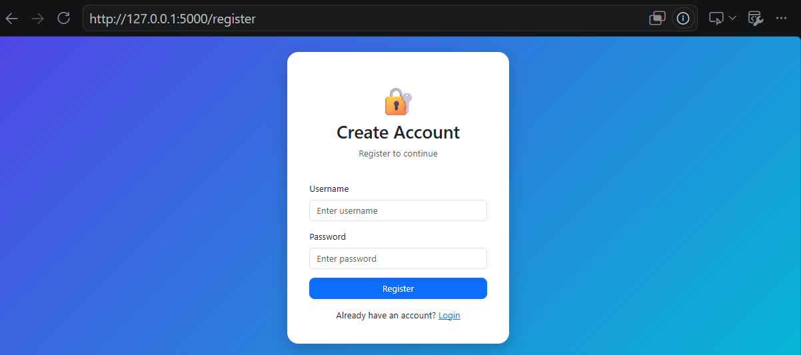
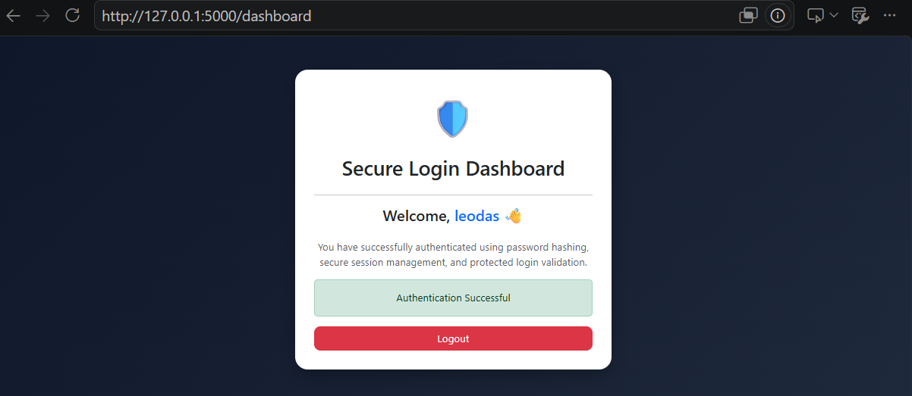

# Secure Login System

A secure web application developed using Flask and SQLite.

 *Features*

- User Registration
- Secure Login Authentication
- Password Hashing using bcrypt
- SQL Injection Prevention
- Session Management
- Logout Functionality

*Technologies Used*

- Python
- Flask
- SQLite
- Bootstrap 5
- HTML/CSS

*Project Outcome*

This project demonstrates secure user authentication practices by implementing password hashing, session management, and database-backed login functionality.

*Screenshots*

#Login Page

#Registration Page

#Dashboard

*Author*

Madhirakshana Ravikumar

